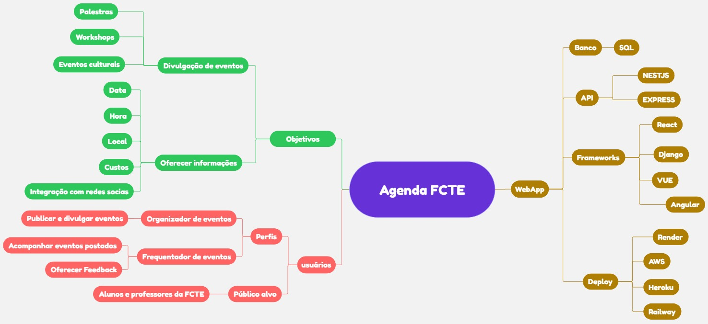

# Mapa Mental 

## Introdução 
Um mapa mental é uma ferramenta visual que ajuda na organização de ideias, facilitando a compreensão, memorização e planejamento de conteúdos. Ele parte de um conceito central e se ramifica em tópicos e subtópicos relacionados, formando uma estrutura em árvore que estimula o raciocínio lógico e criativo.

Essa técnica é amplamente utilizada em planejamento de projetos, estudos, brainstorms e desenvolvimento de software, pois permite uma visão ampla e clara das informações envolvidas. Ao usar elementos visuais como cores, ícones e conexões, o mapa mental transforma conteúdos complexos em algo mais intuitivo e fácil de navegar.

Ao criar um software, por exemplo, o mapa mental pode incluir desde a definição dos requisitos até as tecnologias envolvidas, metodologias aplicadas e possíveis expansões futuras, tornando-se uma ferramenta poderosa para a organização e execução do projeto.

## Metodologia 

Durante uma reunião virtual, o grupo iniciou uma sessão de Brainstorming e, em seguida, começou a construir um Mapa Mental para estruturar e aprofundar todas as ideias compartilhadas sobre a futura aplicação. Cada elemento importante e indispensável debatido foi cuidadosamente inserido no mapa, que aos poucos foi ganhando forma e refletindo a essência do projeto. Por fim, chegamos nesse resultado, reunindo todos os pontos fundamentais para o desenvolvimento do aplicativo. Toda a construção do mapa foi realizada por meio do aplicativo Miro.

## Mapa Mental 

  
<b>Autor:</b> <a href="https://www.github.com/AlexandreLJr">Alexandre Lema, 2025</a>

## Bibliografia

> FERNANDES, Wagner. Você sabe criar um mapa mental efetivo ?. próximosconcuros. Disponível em : https://www.proximosconcursos.com/mapa-mental-efetivo/. Acesso em 06/04/2025.
>
>SERRANO, Milene. VideoAula - DSW-Base - Mapa Mental. Acesso em: 06/04/2025.
---

## Histórico de Versões

| Versão | Data       | Descrição             | Autor                                         | Revisor                                     |
|--------|------------|-----------------------|-----------------------------------------------|---------------------------------------------|
| `1.0`    | 06/04/2025 | Criação do artefato  | [Alexandre Lema](https://github.com/AlexandreLJr) | [Manoela Garcia](https://github.com/manu-sgc) |