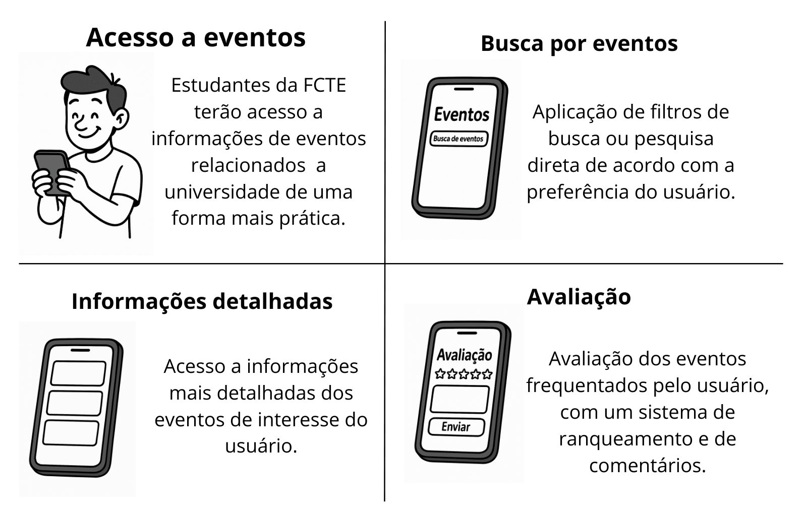

# Storyboard - AgendaFCTE

## Introdução

O storyboard é uma técnica de prototipação que permite representar, de forma simplificada, as interações do usuário com uma determinada plataforma. Este documento tem como objetivo registrar os storyboards elaborados pelos membros da equipe para o projeto AgendaFCTE, uma plataforma voltada à divulgação de eventos culturais promovidos pela Faculdade de Ciências e Tecnologias em Engenharia (FCTE-Gama). Esses storyboards fornecem insights valiosos sobre os fluxos de navegação e uso da plataforma pelos usuários.

## Finalidade do Artefato

Este artefato tem como finalidade analisar as interações descritas nos storyboards, com o objetivo de otimizar os fluxos antes das etapas de prototipagem ou implementação.

## Storyboards

A seguir, estão apresentados os storyboards desenvolvidos pelos membros da equipe sobre a plataforma AgendaFCTE, numerados de 1 a X:

### Thales Euflauzino

A Figura 1 refere-se ao storyboard desenvolvido por [Thales Euflauzino](https://github.com/thaleseuflauzino), no qual o usuário realiza três tarefas na plataforma AgendaFCTE. Cada uma dessas tarefas será explicada após a figura.

 
<strong>Figura 1</strong> - Storyboard - AgendaFCTE (Filtro, Avaliação e Cadastro de Eventos).
 

  
<b>Autor:</b> <a href="https://www.github.com/thaleseuflauzino">Thales Euflauzino</a>, 2025

**1. Buscar eventos mais acessados / por data / por nome**  
Neste fluxo, o usuário acessa a plataforma e pode explorar os eventos disponíveis utilizando filtros de busca, como: os mais acessados, por data ou pelo nome do evento. Ao selecionar um evento, ele visualiza os detalhes, incluindo uma imagem de divulgação, e tem a opção de confirmar presença. A confirmação pode ser seguida de uma seção para visualizar avaliações e comentários de outros usuários sobre aquele evento, ajudando na tomada de decisão.

**2. Avaliação pós-evento**  
Após participar de um evento, o usuário acessa a aba "Seus Eventos" e escolhe aquele que deseja avaliar. Ele visualiza os detalhes do evento (como uma foto de divulgação) e, em seguida, pode registrar sua avaliação por estrelas, além de deixar um comentário. Por fim, basta clicar em salvar avaliação, contribuindo para o feedback do evento e auxiliando outros usuários.

**3. Cadastro de novo evento (organizador)**  
Voltado para os organizadores, este fluxo começa com o acesso à Área do Organizador. Nela, o responsável escolhe a opção "Cadastrar Evento" e preenche um formulário com os dados necessários: nome, data, descrição e imagens relacionadas ao evento. Após o preenchimento, o organizador confirma o cadastro e o evento passa a estar disponível para visualização e participação na plataforma AgendaFCTE.

### Víctor Schmidt

A Figura 2 refere-se ao storyboard desenvolvido por [Víctor Schmidt](https://github.com/moonshinerd), no qual o usuário realiza 4 atividades na plataforma AgendaFCTE. Cada uma dessas tarefas será explicada após a figura.

 
<strong>Figura 2</strong> - Storyboard - AgendaFCTE (Recomendação, Inscrição e Notificação de Eventos).
 

  

  
<b>Autor:</b> <a href="https://www.github.com/moonshinerd">Víctor Schmidt</a>, 2025

**1. O que vai acontecer esse mês?**  
O usuário abre o app e vê a lista de eventos recomendados (exposição, show, competição), perguntando “O que vai rolar esse mês?”.

**2.  Quero participar de uma competição**  
Ele escolhe um evento (“competição”) e preenche nome, matrícula e idade para se inscrever.

**3. Inscrição realizada com sucesso**  
Surge a mensagem de confirmação: “Você será notificado”. O usuário comemora: “Vou participar de RRDD esse mês!”

**4. Um dia antes do evento**  
O app envia um lembrete push com o ícone de aviso sobre o evento no calendário, garantindo que ele não esqueça.

### Victor Hugo Bernardes

A Figura 3 refere-se ao storyboard desenvolvido por [Victor Bernardes](https://github.com/VHbernardes), no qual o usuário realiza três tarefas na plataforma AgendaFCTE. Cada uma dessas tarefas será explicada após a figura.

 
<strong>Figura 3</strong> - Storyboard - AgendaFCTE (Filtro, Inscrição e Notificações).
 

  
<b>Autor:</b> <a href="https://www.github.com/VHbernardes">Victor Hugo Bernardes</a>, 2025

**1. Filtragem e Busca pelo evento desejado**  
Neste fluxo, o usuário (João Henrique, calouro da FCTE) acessa a plataforma Agenda Cultural FCTE com o objetivo de conhecer mais sobre o campus e se integrar à comunidade acadêmica. Ele navega pela página inicial e utiliza o filtro de busca para encontrar eventos voltados à integração de calouros. Ao aplicar o filtro, localiza o evento "Tour Acadêmico e Palestra de Boas-Vindas".

**2. Acesso aos detalhes e Inscrição no evento**  
Após isso, o João acessa os detalhes do evento, visualiza a descrição, imagem de divulgação e programação, e decide se inscrever. Ele preenche um formulário com nome, e-mail e matrícula.

**3. Confirmação da inscrição e Notificações**  
Após a inscrição, recebe um aviso na tela informando que um e-mail de confirmação foi enviado, e que poderá receber notificações push com lembretes sobre o evento.

### Victório Lázaro

A Figura 4 refere-se ao storyboard desenvolvido por [Victório Lázaro](https://github.com/Victor-oss), no qual o usuário realiza 3 atividades na plataforma AgendaFCTE. Cada uma dessas tarefas será explicada após a figura.

 
<strong>Figura 4</strong> - Storyboard - AgendaFCTE (Busca, Visualização e Inscrição de Evento).
 

  

  
<b>Autor:</b> <a href="https://github.com/Victor-oss">Victório Lázaro</a>, 2025

**1. Busca dos eventos no mês**  
O usuário abre a aplicação e pode visualizar os eventos que vão acontecer em um certo mês. Ele também pode filtrar por nome e por tipo os eventos que aparecem no calendário. Ele seleciona um dia e mês e os eventos filtrados aparecem em uma lista.

**2.  Visualizando um evento**  
Ele pode visualizar os eventos do dia e escolher um deles para se inscrever.

**3. Inscrição realizada com sucesso**  
Surge um modal de confirmação para verificar se ele deseja se inscrever no evento clicado e tem um checkbox que garante que uma notificação será mandada no whatsapp do usuário no dia anterior ao evento caso ele prossiga com a inscrição.

### Alexandre Lema

A Figura 5 refere-se ao storyboard desenvolvido por [Alexandre Lema](https://github.com/AlexandreLJr), no qual o usuário realiza três tarefas na plataforma AgendaFCTE. Cada uma dessas tarefas será explicada após a figura.

 
<strong>Figura 5</strong> - Storyboard - AgendaFCTE (Filtro, Avaliação e Cadastro de Eventos).
 

  
<b>Autor:</b> <a href="https://www.github.com/AlexandreLJr">Alexandre Lema</a>, 2025

**1. Acesso ao aplicativo de eventos**  
Inicialmente o usuário terá acesso a aplicação onde poderá encontrar diversos eventos cadastrados por alunos ou professores da Universidade de Brasília, sejam palestras, workshops, eventos culturais, etc.

**2. Busca mais detalhada**  
Após o acesso inicial, o usuário poderá aplicar um filtro de busca de acordo com suas preferências para encontrar o que deseja. Essa busca pode ser feita por data, local, gênero, nome, etc.

**3. Informações detalhadas**  
Ao encontrar o evento de sua escolha, será possível o acesso de informações mais detalhadas a respeito do seu evento.

**4. Avaliação**  
Por fim, ele pode fornecer um feedback a respeito dos eventos que estão disponíveis, fornecendo comentários, fotos ou notas para informar os demais usuários que procuram saber sobre o mesmo evento.

### Pedro Lopes

A Figura 6 a seguir representa o storyboard desenvolvido por [Pedro Lopes](https://github.com/pLopess) da plataforma AgendaFCTE, onde o usuário realiza quatro atividades principais: busca de eventos, visualização de detalhes, inscrição e favoritar eventos. Cada uma dessas ações é descrita logo após a figura.

  
<strong>Figura 6</strong> - Storyboard - AgendaFCTE (Busca, Inscrição e Favoritos).

  
  
<strong>Autor:</strong> <a href="https://www.github.com/pLopess">Pedro Lopes</a>, 2025

**1. O que está rolando na faculdade?**  
O usuário acessa o site da AgendaFCTE e utiliza a barra de busca e os filtros para explorar os eventos disponíveis. Ele quer saber o que está acontecendo na FCTE, seja uma palestra, um workshop ou uma atividade cultural.

**2. Gostei desse evento! Quero saber mais.**  
Ao encontrar um evento interessante, o usuário clica no card para visualizar todos os detalhes: descrição, local, data, horário e quem são os responsáveis.

**3. Quero garantir minha vaga!**  
Decidido a participar, ele clica no botão "Inscreva-se" e realiza sua inscrição na própria plataforma. Uma mensagem de confirmação aparece, garantindo que sua vaga está reservada.

**4. Vou deixar esse salvo para depois.**  
O usuário também pode favoritar eventos que chamaram sua atenção, mas que ele ainda não decidiu se vai participar. Esses eventos ficam salvos na área pessoal para fácil acesso no futuro.

## Conclusão

A partir dos storyboards apresentados, é possível identificar algumas das funcionalidades essenciais para o desenvolvimento do projeto, assim como visualizar os principais fluxos de interação do usuário com a plataforma. Ao acessar o sistema, o usuário poderá filtrar os eventos por data, tipo, nome ou pelos mais acessados, poderá se inscrever nos eventos e visualizar seus detalhes. Além disso, será possível avaliar os eventos dos quais participou, contribuindo com feedbacks, receber notificações push com detalhes do evento. Já os organizadores terão acesso a uma área específica para cadastrar novos eventos, informando dados como nome, data, descrição e imagens de divulgação. Esse artefato permite validar a importância dessas funcionalidades para a construção da plataforma AgendaFCTE.

## Histórico de Versão

| Versão | Data       | Descrição               | Autor                                             | Revisor                                                |
| ------ | ---------- | ----------------------- | ------------------------------------------------- | ------------------------------------------------------ |
|  `1.0`   |       08/04/2025       |         Criação do documento        | [Thales Euflauzino](https://github.com/thaleseuflauzino) | |
|  `1.1`   |       08/04/2025       |         Adição da storyboard pessoal        | [Thales Euflauzino](https://github.com/thaleseuflauzino) | [Pedro Lopes](https://github.com/pLopess) |
|  `1.2`   |       08/04/2025       |          Adição do storyboard pessoal       | [Víctor Schmidt](https://github.com/moonshinerd) | [Pedro Lopes](https://github.com/pLopess) |
|  `1.3`   |       08/04/2025       |          Adição do storyboard pessoal       | [Victor Hugo Bernardes](https://github.com/VHbernardes)  |  [Pedro Lopes](https://github.com/pLopess) |
|  `1.4`   |       08/04/2025       |          Adição do storyboard pessoal       |  [Victório Lázaro](https://github.com/Victor-oss) |  [Pedro Lopes](https://github.com/pLopess) |
|  `1.5`   |       08/04/2025       |          Adição do storyboard pessoal       |  [Alexandre Lema](https://github.com/AlexandreLJr) |  [Pedro Lopes](https://github.com/pLopess) |
|  `1.6`   |       08/04/2025       |          Adição do storyboard pessoal       |  [Pedro Lopes](https://github.com/pLopess) ||