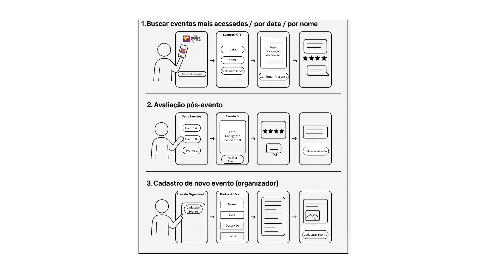

# Storyboard

## Introdução

O storyboard é uma técnica de prototipação que permite representar, de forma simplificada, as interações do usuário com uma determinada plataforma. Este documento tem como objetivo registrar os storyboards elaborados pelos membros da equipe para o projeto AgendaFCTE, uma plataforma voltada à divulgação de eventos culturais promovidos pela Faculdade de Ciências e Tecnologias em Engenharia (FCTE-Gama). Esses storyboards fornecem insights valiosos sobre os fluxos de navegação e uso da plataforma pelos usuários.

## Finalidade do Artefato

Este artefato tem como finalidade analisar as interações descritas nos storyboards, com o objetivo de otimizar os fluxos antes das etapas de prototipagem ou implementação.

## Storyboards

A seguir, estão apresentados os storyboards desenvolvidos pelos membros da equipe sobre a plataforma AgendaFCTE, numerados de 1 a X:

A Figura 1 refere-se ao storyboard desenvolvido por [Thales Euflauzino](https://github.com/thaleseuflauzino), no qual o usuário realiza três tarefas na plataforma AgendaFCTE. Cada uma dessas tarefas será explicada após a figura.

 
<strong>Figura 1</strong> - Storyboard - AgendaFCTE (Filtro, Avaliação e Cadastro de Eventos).
 

  
<b>Autor:</b> <a href="https://www.github.com/thaleseuflauzino">Thales Euflauzino</a>, 2025

**1. Buscar eventos mais acessados / por data / por nome**  
Neste fluxo, o usuário acessa a plataforma e pode explorar os eventos disponíveis utilizando filtros de busca, como: os mais acessados, por data ou pelo nome do evento. Ao selecionar um evento, ele visualiza os detalhes, incluindo uma imagem de divulgação, e tem a opção de confirmar presença. A confirmação pode ser seguida de uma seção para visualizar avaliações e comentários de outros usuários sobre aquele evento, ajudando na tomada de decisão.

**2. Avaliação pós-evento**  
Após participar de um evento, o usuário acessa a aba "Seus Eventos" e escolhe aquele que deseja avaliar. Ele visualiza os detalhes do evento (como uma foto de divulgação) e, em seguida, pode registrar sua avaliação por estrelas, além de deixar um comentário. Por fim, basta clicar em salvar avaliação, contribuindo para o feedback do evento e auxiliando outros usuários.

**3. Cadastro de novo evento (organizador)**  
Voltado para os organizadores, este fluxo começa com o acesso à Área do Organizador. Nela, o responsável escolhe a opção "Cadastrar Evento" e preenche um formulário com os dados necessários: nome, data, descrição e imagens relacionadas ao evento. Após o preenchimento, o organizador confirma o cadastro e o evento passa a estar disponível para visualização e participação na plataforma AgendaFCTE.

## Histórico de Versão

| Versão | Data       | Descrição               | Autor                                             | Revisor                                                |
| ------ | ---------- | ----------------------- | ------------------------------------------------- | ------------------------------------------------------ |
|  `1.0`   |       08/04/2025       |         Criação do documento        | [Thales Euflauzino](https://github.com/thaleseuflauzino) | |
|  `1.1`   |       08/04/2025       |         Adição da storyboard pessoal        | [Thales Euflauzino](https://github.com/thaleseuflauzino) | |
