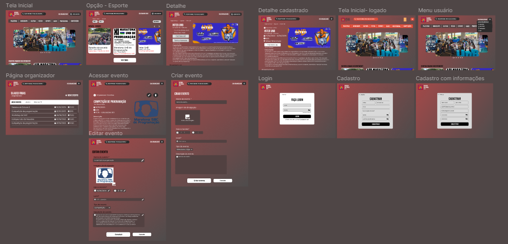
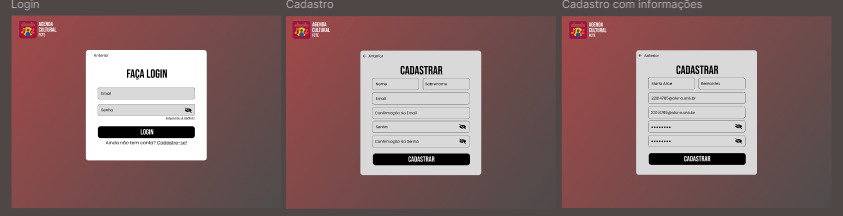
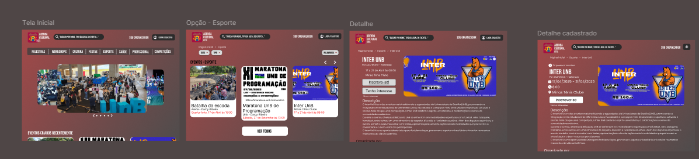
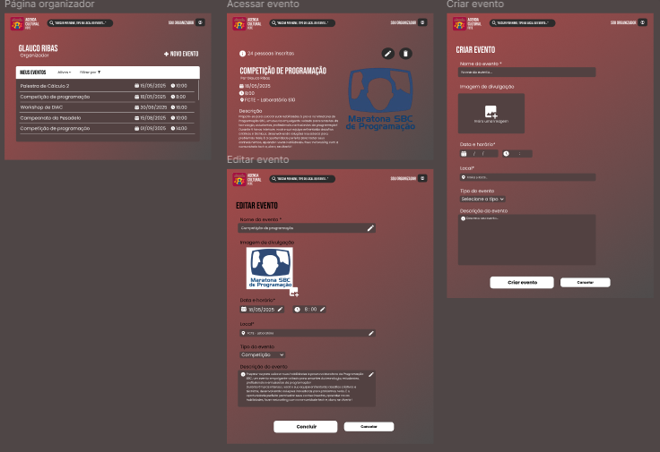

# Protótipo

## Introdução
No desenvolvimento de soluções digitais, a prototipação desempenha um papel crucial na validação de ideias e na antecipação de problemas antes da implementação final. Os protótipos de alta fidelidade aproximam-se muito do produto final em termos de aparência e interação, permitindo testes mais realistas com usuários e uma melhor comunicação entre equipes de design, desenvolvimento e stakeholders.

Dentre as diversas ferramentas disponíveis para prototipagem, o Figma se destaca por sua abordagem colaborativa em nuvem, que permite que várias pessoas trabalhem simultaneamente em um mesmo projeto, promovendo agilidade e alinhamento.

## Metodologia
A metodologia adotada para a construção do protótipo de alta fidelidade envolveu uma abordagem iterativa e centrada no usuário, com base nos requisitos previamente elicitados. Para o desenvolvimento visual e interativo do protótipo, foi utilizada a ferramenta Figma, escolhida por sua interface intuitiva, recursos colaborativos em tempo real e ampla aceitação no mercado de design digital.

As etapas seguidas foram:
1. Análise dos requisitos elicitados previamente
2. Esboço inicial no Figma
3. Melhorias contínuas da aparência do protótipo
4. Adição das cores e fontes baseando-se no guia de estilo

## Protótipo de alta fidelidade

### Desktop

Abaixo na figura 01 é mostrado o protótipo de alta fidelidade da versão desktop e logo abaixo temos o protótipo direto com a ferramenta figma.

Figura 01: Protótipo de Alta Fidelidade - Desktop

<b>Autor:</b> <a href="https://www.github.com/VHbernardes">Victor Hugo Bernardes</a>

Protótipo de Alta fidelidade - Desktop

<iframe style="border: 1px solid rgba(0, 0, 0, 0.1);" width="800" height="450" src="https://www.figma.com/embed?embed_host=share&url=https://www.figma.com/proto/7vZnlHlbvXzaEt2ikloFPx/Prot%C3%B3tipo---AgendaFCTE?node-id=0-1&scaling=scale-down&page-id=0%3A1&starting-point-node-id=64%3A74" allowfullscreen></iframe>

<b>Autor:</b> <a href="https://www.github.com/VHbernardes">Victor Hugo Bernardes</a>

#### Login e Cadastro

Abaixo na figura 02 é mostrado o protótipo de alta fidelidade da tela de login e cadastro.

Figura 02: Protótipo de Alta Fidelidade - Desktop - Telas de Login e Cadastro

<b>Autor:</b> <a href="https://www.github.com/VHbernardes">Victor Hugo Bernardes</a>

#### Home, culturas e eventos

Abaixo na figura 03 é mostrado o protótipo de alta fidelidade das telas de Home e eventos.

Figura 03: Protótipo de Alta Fidelidade - Desktop - Home e eventos 

<b>Autor:</b> <a href="https://www.github.com/VHbernardes">Victor Hugo Bernardes</a>

#### Organizador - Página do organizador, eventos e criação de eventos

Abaixo na figura 04 é mostrado o protótipo de alta fidelidade da versão Desktop das telas do organizador, como página do organizador, eventos criados e criação de eventos. 

Figura 04: Protótipo de Alta Fidelidade - Desktop - Página do organizador, eventos e criação de eventos 

<b>Autor:</b> <a href="https://www.github.com/VHbernardes">Victor Hugo Bernardes</a>

## Histórico de Versões

| Versão | Data       | Descrição             | Autor                                         | Revisor                                     |
|--------|------------|-----------------------|-----------------------------------------------|---------------------------------------------|
| `1.0`    | 08/04/2025 | Criação do documento  | [Manoela Garcia](https://github.com/manu-sgc) |  |
| `1.1`    | 10/04/2025 | Adição dos protótipos de alta fidelidade  | [Victor Hugo Bernardes](https://github.com/VHbernardes) |  |