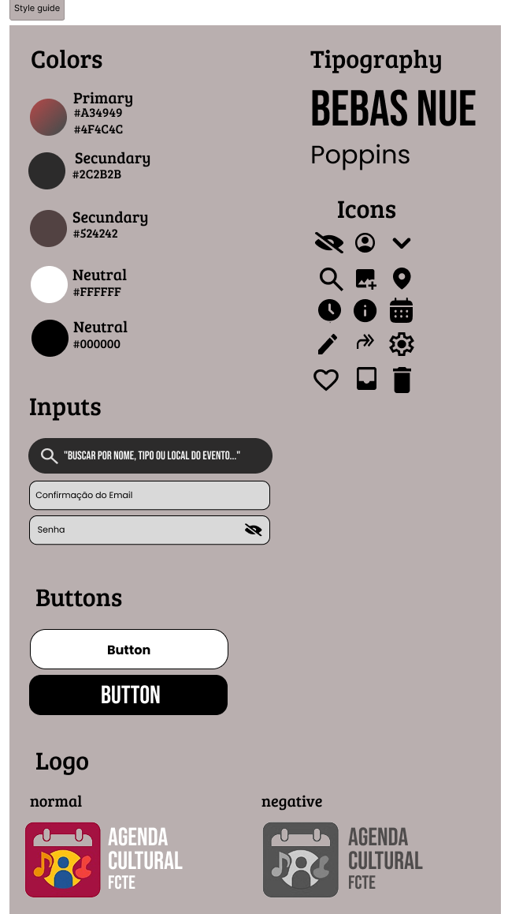

# Guia de Estilo

Este guia de estilo foi criado para padronizar a aparência, o comportamento e a experiência oferecida pela interface do nosso sistema, garantindo coesão visual e usabilidade em todos os pontos de contato com o usuário. Seguir essas diretrizes é fundamental para proporcionar uma experiência intuitiva, acessível e agradável, independentemente do dispositivo utilizado. Além disso, um design consistente reduz o tempo de aprendizado, aumenta a eficiência do usuário e fortalece a identidade visual do software.

Este guia aborda aspectos como tipografia, cores, componentes visuais, responsividade e boas práticas de design de interação. Ele serve como referência para todos os membros da equipe de design e desenvolvimento, promovendo a colaboração e a continuidade visual ao longo das evoluções do produto.
Uma interface bem projetada não é apenas bonita — ela é funcional, coerente e centrada no usuário.

  
<b>Autor:</b> <a href="https://www.github.com/AlexandreLJr">Alexandre Lema</a> e <a href="https://github.com/maykonjuso">Maykon Soares</a>

## Histórico de Versões

| Versão | Data       | Descrição             | Autor                                         | Revisor                                     |
|--------|------------|-----------------------|-----------------------------------------------|---------------------------------------------|
| `1.0`    | 10/04/2025 | Criação do artefato  | [Alexandre Lema](https://github.com/AlexandreLJr) e [Maykon Soares](https://github.com/maykonjuso)  |  |