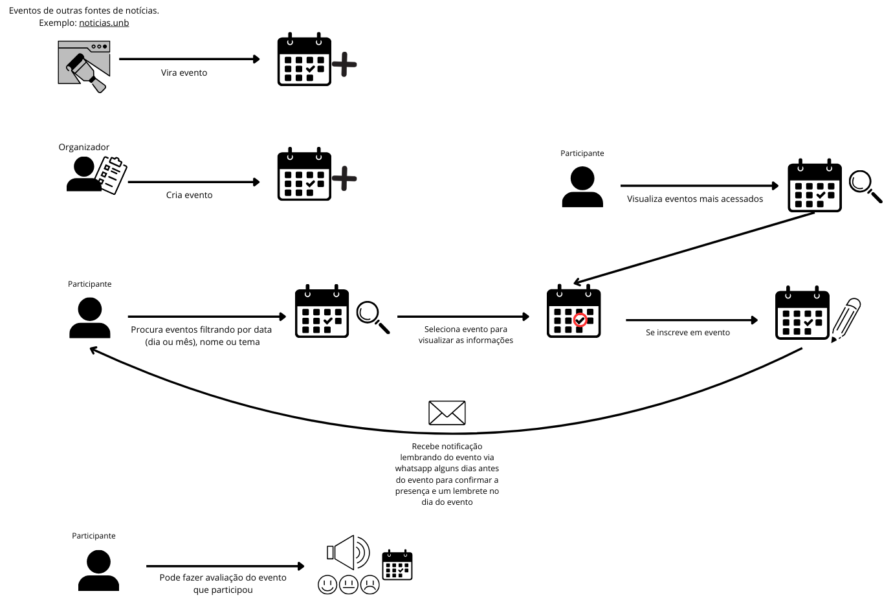
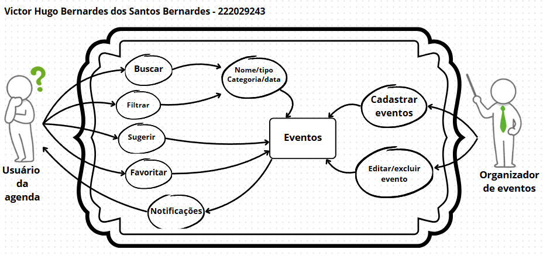
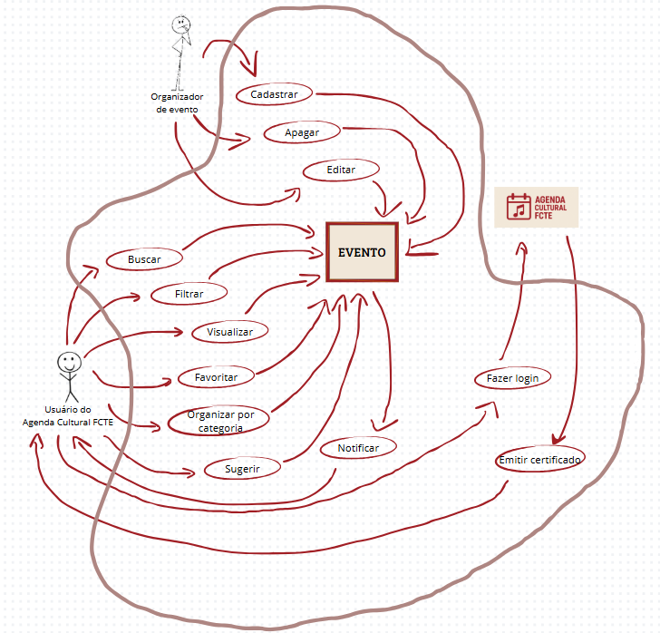
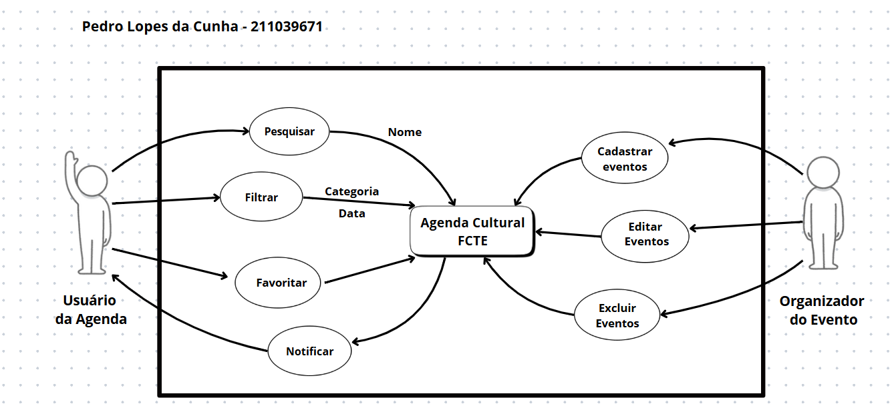
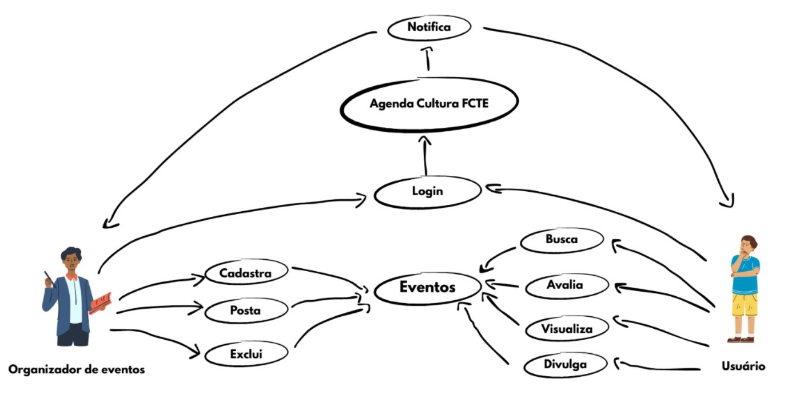

# Rich Picture

## Introdução

Rich Picture é uma ferramenta visual para expressar ideias e analisar problemas, tudo isso de forma informal e de fácil entendimento. No contexto da engenharia de software, ele é utilizado para abstrair o funcionamento de sistemas de software e se apresenta na forma de um diagrama com alguns elementos básicos como: atores, funcionalidades, armazenamento de dados, fluxo de dados e limites do sistema. [1](#referências)

## Metodologia

A elaboração das *Rich Pictures* seguiu uma abordagem colaborativa e individualizada, com o objetivo de capturar diferentes visões dos membros do grupo sobre o sistema em análise. A seguir, descrevemos as etapas adotadas para a construção deste artefato:

1. **Introdução ao Conceito de Rich Picture**  
   Inicialmente, o grupo realizou um estudo teórico sobre o conceito de *Rich Picture*, com base em literatura da área de Engenharia de Requisitos e Soft Systems Methodology (SSM)[2](#referências). Foi discutida a importância desse artefato na representação de sistemas complexos de forma visual e compreensível.

2. **Análise do Domínio do Problema**  
   Cada membro do grupo analisou o domínio do problema de forma independente, identificando os principais atores, processos, fluxos de informação, conflitos e possíveis pontos de melhoria no sistema atual.

3. **Construção Individual das Rich Pictures**  
   Com base na análise feita, cada membro elaborou uma *Rich Picture* utilizando ferramentas gráficas de sua escolha (como Canva, Draw.io, Figma, entre outras). O foco foi representar visualmente as percepções individuais sobre o sistema, promovendo liberdade criativa e expressiva.

4. **Compartilhamento e Discussão em Grupo**  
   As *Rich Pictures* produzidas foram compartilhadas em uma reunião de grupo, onde cada membro apresentou sua interpretação. Houve espaço para discussão, comparação de visões e identificação de pontos em comum ou divergentes entre os modelos.

5. **Documentação das Rich Pictures**  
   Por fim, as imagens foram organizadas neste documento, acompanhadas de uma breve descrição de cada autor sobre sua representação. Essa etapa visa facilitar o entendimento externo e registrar o raciocínio por trás das escolhas feitas.

Essa metodologia permitiu que cada integrante expressasse sua compreensão do sistema de forma livre, fomentando o pensamento crítico e ampliando a visão coletiva do grupo sobre o problema abordado.

#### Figura 1: Rich Picture 1.

<b>Autor:</b> <a href="https://www.github.com/thaleseuflauzino">Thales Euflauzino</a>

#### Figura 2: Rich Picture 2.

<b>Autor:</b> <a href="https://www.github.com/Victor-oss">Victório Lázaro</a>

#### Figura 3: Rich Picture 3.

<b>Autor:</b> <a href="https://www.github.com/VHbernardes">Victor Hugo Bernardes</a>

#### Figura 4: Rich Picture 4.

<b>Autor:</b> <a href="https://www.github.com/moonshinerd">Víctor Schmidt</a>

#### Figura 5: Rich Picture 5.

<b>Autor:</b> <a href="https://www.github.com/manu-sgc">Manoela Garcia</a>

#### Figura 6: Rich Picture 6.

<b>Autor:</b> <a href="https://www.github.com/pLopess">Pedro Lopes</a>

#### Figura 7: Rich Picture 7.

<b>Autor:</b> <a href="https://www.github.com/AlexandreLJr">Alexandre Lema</a>

## Referências

> 1. BURGE, Stuart. An Overview of the Soft Systems Methodology. In: System Thinking: Approaches and Methodologies. [S.l.]: Burge Hughes Walsh, 2015. Disponível em: https://www.burgehugheswalsh.co.uk/Uploaded/1/Documents/Soft-Systems-Methodology.pdf​. Acesso em: 06/04/2025.
>
> 2. SERRANO, Maurício; SERRANO, Milene. Requisitos - Aula 4. Distrito Federal, 2016. Acesso em: 06/04/2025.
> 
## Histórico de Versões

Versão  | Data | Descrição | Autor(es) | Revisor(es)
-------- | ------ | ------ | ---------- | ----------
`1.0` | 06/04/2025 | Elaboração do artefato esqueleto | [Thales Euflauzino](https://github.com/thaleseuflauzino) | [Pedro Lopes](https://github.com/pLopess) |
`1.1` | 06/04/2025 | Adição da richpicture pessoal | [Thales Euflauzino](https://github.com/thaleseuflauzino) | [Pedro Lopes](https://github.com/pLopess) |
`1.2` | 06/04/2025 | Adição da richpicture pessoal | [Victório Lázaro](https://github.com/Victor-oss) | [Thales Euflauzino](https://github.com/thaleseuflauzino) |
`1.3` | 06/04/2025 | Adição da richpicture pessoal | [Victor Hugo Bernardes](https://github.com/VHbernardes) | [Thales Euflauzino](https://github.com/thaleseuflauzino) |
`1.4` | 06/04/2025 | Adição da richpicture pessoal | [Víctor Schmidt](https://github.com/moonshinerd) | [Thales Euflauzino](https://github.com/thaleseuflauzino) |
`1.5` | 06/04/2025 | Adição da richpicture pessoal | [Manoela Garcia](https://github.com/manu-sgc) | [Pedro Lopes](https://github.com/pLopess) |
`1.6` | 06/04/2025 | Adição da richpicture pessoal | [Pedro Lopes](https://github.com/pLopess) | |
`1.7` | 06/04/2025 | Adição da richpicture pessoal | [Alexandre Lema](https://github.com/AlexandreLJr) | |
