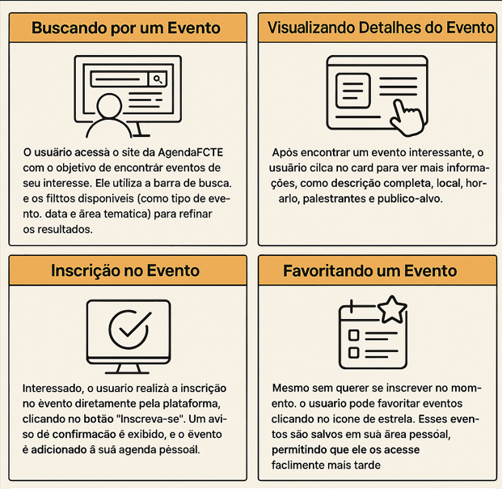

# Nome do Projeto

**Código da Disciplina**: FGA0208 
**Número do Grupo**: 04 
**Entrega**: 01 

## Alunos
|Matrícula | Aluno |
| -- | -- |
| 20/2015868     | Alexandre Lema Xavier                  |
| ~~21/1039484~~ | ~~Iago Rocha Santos Marques~~              |
| 17/0146243     | João Lucas Costa Vale                  |
| 22/2015186     | Manoela Silvestre Garcia               |
| 21/1030863     | Maykon Júnio dos Santos Soares         |
| 21/1039671     | Pedro Lopes da Cunha                   |
| 22/2006178     | Thales Henrique Euflauzino dos Santos  |
| 22/2029243     | Victor Hugo dos Santos Bernardes       |
| 22/2021924     | Víctor Hugo Lima Schmidt               |
| 21/1031860     | Victório Lázaro Rocha de Morais        |

## Sobre 
O AgendaFCTE é um web‑app que centraliza todos os eventos da FCTE em um só lugar, exibindo data, hora, local, descrição, link de inscrição e contato. Usuários autenticados (por e‑mail) podem filtrar a lista por tema, localização ou palavra‑chave, favoritar eventos, cadastrar novos eventos e gerenciar inscrições com controle de vagas, além de entrar em contato direto com os organizadores.

### Mapa Mental

### Richpicture

### Storyboard

## Screenshots da Primeira Entrega
Adicione 2 ou mais screenshots em termos de artefatos realizados na entrega.

## Há algo a ser executado?

( ) SIM

(X) NÃO

Se SIM, insira um manual (ou um script) para auxiliar ainda mais os interessados na execução.

## Informações Complementares 
Quaisquer outras informações adicionais podem ser descritas nessa seção.

## Histórico de Versões

| Versão | Data       | Descrição | Autor     |       Revisor         |
| ------ | ---------- | --------- | --------- | --------------------- |
| `1.0` | 10/04/2025 | Criação do documento |[Víctor Schmidt](https://github.com/moonshinerd) |  [Thales Euflauzino](https://github.com/thaleseuflauzino) |
